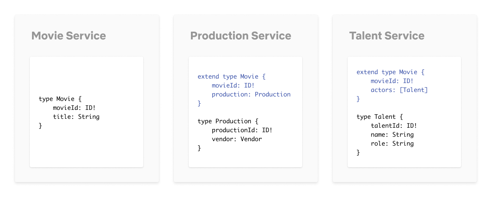
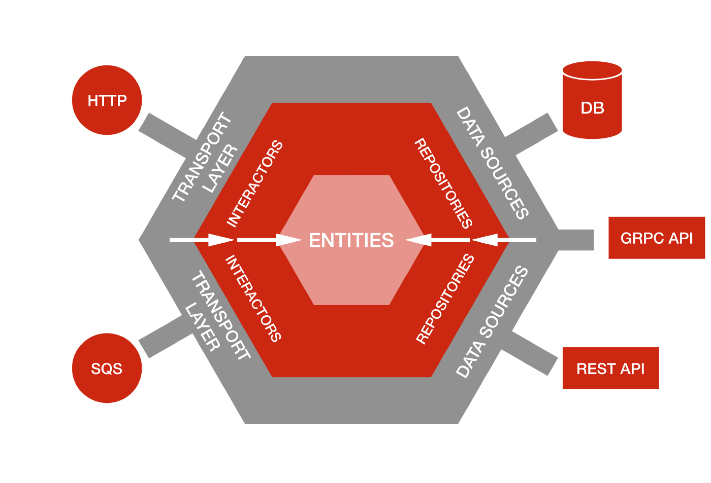

<center>
  <p align="center">
    
  </p>  
  <h1 align="center">Netflix: Studio API 🚀</h1>
  <p align="center">
    Creation of a simple Netflix Studio API clone for study and practice with Kotlin, Coroutines and Netflix DGS framework (GraphQL).
  </p>
</center>
<br />

## Blog posts

- [How Netflix Scales its API with GraphQL Federation (Part 1)](https://netflixtechblog.com/how-netflix-scales-its-api-with-graphql-federation-part-1-ae3557c187e2)
- [Open Sourcing the Netflix Domain Graph Service Framework: GraphQL for Spring Boot](https://netflixtechblog.com/open-sourcing-the-netflix-domain-graph-service-framework-graphql-for-spring-boot-92b9dcecda18)
- [Ready for changes with Hexagonal Architecture](https://netflixtechblog.com/ready-for-changes-with-hexagonal-architecture-b315ec967749)

## Model



## Architecture


## Application Architecture

Simplistic hexagonal architecture based on [Netflix post](https://netflixtechblog.com/ready-for-changes-with-hexagonal-architecture-b315ec967749).



## Running

### Storages

**Redis and MySQL with Docker**

```shell
docker-compose up -d
```

### Services

**Talent Service**

```shell
./gradlew talent-service:bootRun
```

**Production Service**

```shell
./gradlew production-service:bootRun
```

**Movie Service**

```shell
./gradlew movie-service:bootRun
```